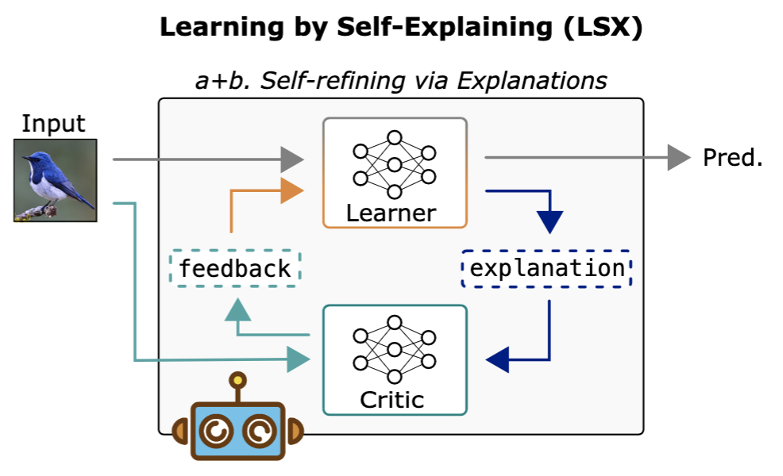

# Learning by Self-Explaining
Repository for ```Learning by Self-Explaining``` paper.



This repo contains the code for both the CNN-LSX and NeSy-LSX experiments.

Concerning the VLM-LSX instantiation we refer to the following repo and corresponding paper: [ILLUME](https://github.com/ml-research/ILLUME).

Disclaimer: this repository is an agglomerate of multiple repositories and from several projects. 
It is therefore missing a global structure and might be buggy in terms of requirements etc (please don't hate me). 

## ---Docker---
We have attached a Dockerfile to make reproduction easier. We further recommend to build your own docker-compose file 
based on the DockerFile. To run without a docker-compose file:
```
cd docker/
docker build -t pytorch-lsx -f Dockerfile .
docker run -it -v /pathtofolder:/workspace/repositories/learning_by_self-explaining -v /pathtodata:/workspace/datasets/ --name pytorch-lsx --entrypoint='/bin/bash' --runtime nvidia pytorch-lsx
```

## ---Parameter settings---
In all subdirectories we provide the folder ```parameters/``` which contains argument files for different experimental 
settings. We thus refer to these for hyperparameter details as well as the existing example bash scripts. 

## ---Running code---
We provide information on how to run the individual experiments in the README's of each subdirectory.


